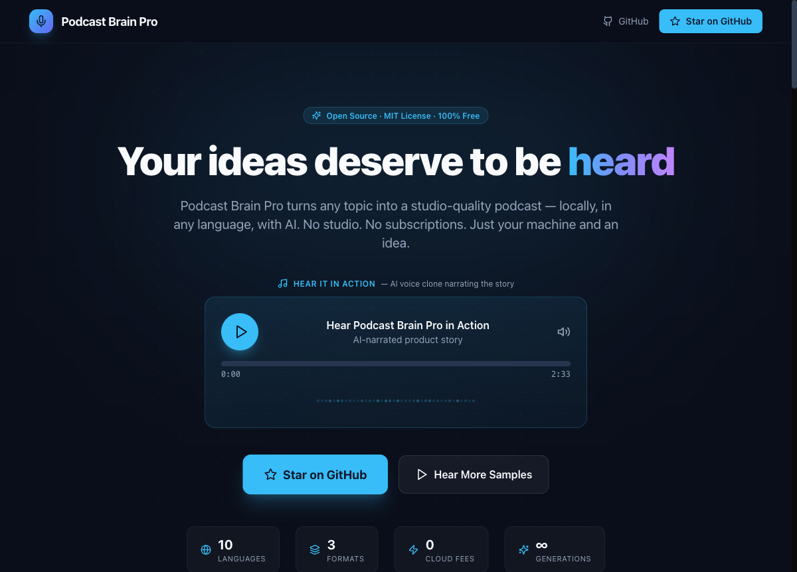
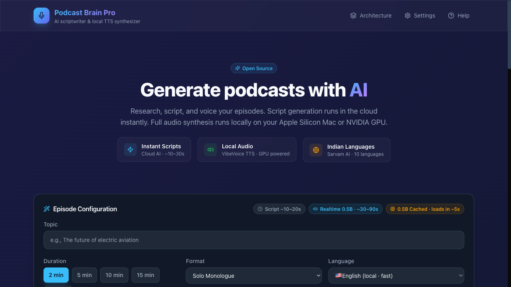
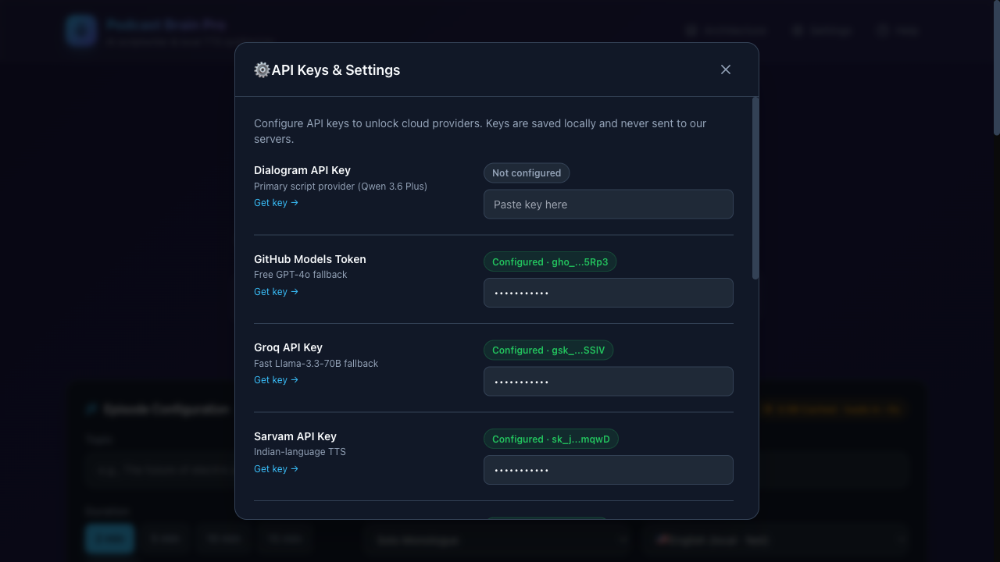
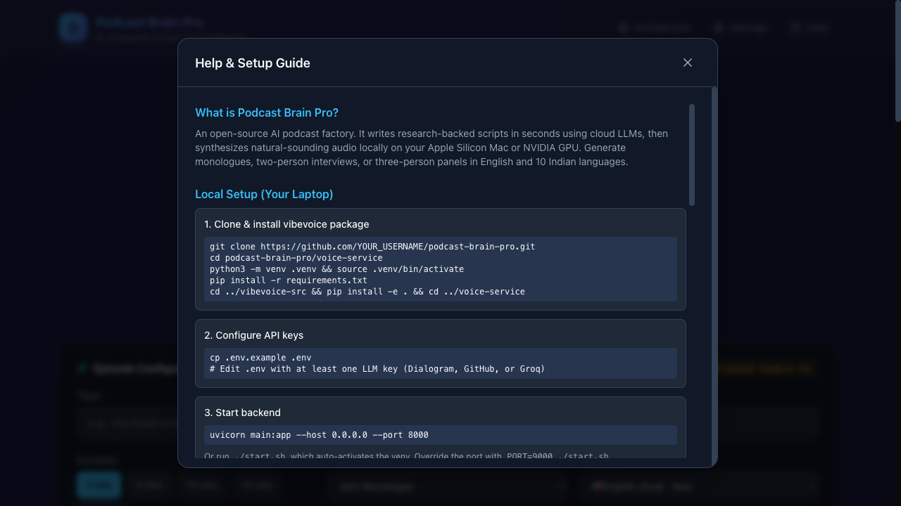

# 🎙️ Podcast Brain Pro

> Turn any topic into a studio-quality podcast — locally, in any language, with AI.

[](./LICENSE)
[](https://www.python.org/downloads/)
[](https://nodejs.org/)
[]()
[]()

[🎧 **Live Samples**](https://frontend-chi-virid-53.vercel.app/landing) · [📖 **Docs**](./docs/SETUP.md) · [⭐ **Star on GitHub**](https://github.com/niranjannie/podcast-brain-pro)

---

## Why I Built This

I spent entire weekends trying to create just one short podcast. Writing scripts. Recording again and again. Fixing mistakes. Editing endlessly.

By the time it was done, I was already exhausted.

**What if creating a podcast was as simple as typing a sentence?**

That's Podcast Brain Pro. An open-source AI podcast factory that runs entirely on your own machine. No studio. No cloud dependency. No subscriptions.

Type a topic. Get a researched, natural script. Choose monologue, interview, or panel. Generate studio-quality audio locally. In English or 10 Indian languages.

Your ideas deserve to be heard.

---

## ✨ What It Does

| Step | What Happens | Time |
|------|-------------|------|
| 1. Enter a topic | AI researches via web search and writes a natural script | ~10–30s |
| 2. Choose format | Monologue, two-person interview, or three-person panel | Instant |
| 3. Pick language | English or 10 Indian languages | Instant |
| 4. Generate audio | Local VibeVoice TTS synthesizes human-sounding speech | 30s–15min |
| 5. Export | WAV + RSS feed + JSON metadata | Instant |

**Languages:** English, Hindi, Kannada, Tamil, Telugu, Marathi, Bengali, Gujarati, Malayalam, Punjabi, Assamese

**Output formats:** Solo monologue · Two-person interview · Three-person panel discussion

---

## 🚀 Quick Start

> **Prerequisites:** macOS Apple Silicon (M1–M4) or Linux/Windows + NVIDIA GPU · Python 3.10+ · Node.js 18+ · ~15 GB disk space

```bash
# 1. Clone
git clone https://github.com/niranjannie/podcast-brain-pro.git
cd podcast-brain-pro

# 2. Install backend
cd voice-service
python3 -m venv .venv && source .venv/bin/activate
pip install -r requirements.txt
cd ../vibevoice-src && pip install -e . && cd ../voice-service

# 3. Configure keys
cp .env.example .env
# Add at least one LLM key (Dialogram recommended — free tier)

# 4. Start backend
source .venv/bin/activate
uvicorn main:app --host 0.0.0.0 --port 8000

# 5. Start frontend (new terminal)
cd ../frontend && npm install && npm run dev
# Open http://localhost:3000
```

Full setup guide: [`docs/SETUP.md`](./docs/SETUP.md)

---

## 🎯 What Makes It Different

- **Runs entirely on your machine** — Audio synthesis happens locally. No data leaves your computer.
- **10 Indian languages** — Hindi, Kannada, Tamil, Telugu, Marathi, Bengali, Gujarati, Malayalam, Punjabi, Assamese. Built for multilingual creators.
- **Natural dialogue formats** — Not just reading text aloud. Interview and panel modes generate interruptions, disagreements, and follow-ups.
- **RSS feed built-in** — Generate once, publish everywhere. No extra tools needed.
- **Truly open source** — MIT licensed. Full code, full control, zero restrictions.

---

## 🎧 Live Samples

Hear real episodes generated from a single sentence — zero editing:

🔗 **[https://frontend-chi-virid-53.vercel.app/landing](https://frontend-chi-virid-53.vercel.app/landing)**

| Sample | Language | Format | Length |
|--------|----------|--------|--------|
| AI Future Discussion | 🇺🇸 English | Interview | 5:12 |
| Technology Trends Panel | 🇺🇸 English | Panel | 3:42 |
| Nation Building: India vs China | 🇮🇳 Hindi | Interview | 4:49 |
| Delhi Air Pollution & Government | 🇮🇳 Hindi | Panel | 4:04 |
| Bangalore News Update | 🇮🇳 Kannada | Interview | 3:04 |

---

## 🖼️ Screenshots

### Landing Page


### App Interface


### Settings Modal


### Help & Setup Guide


See [`docs/screenshots/`](./docs/screenshots/) for full resolution images.

---

## 📦 Model Downloads (Automatic)

On first audio generation, models download automatically from HuggingFace:

| Model | Size | Time | Use Case |
|-------|------|------|----------|
| VibeVoice Realtime 0.5B | ~2 GB | ~2–5 min | English monologue ≤10 min |
| VibeVoice Longform 1.5B | ~5.4 GB | ~5–10 min | Multi-speaker / >10 min |
| VibeVoice ASR 7B | ~14 GB | ~10–15 min | Speech-to-text (optional) |

**Cache:** `~/.cache/huggingface/hub/`

---

## 🏗️ Architecture

```
Topic → Web Research → LLM Script → TTS Engine → Audio + RSS
```

**Stack:**
- **Frontend:** Next.js 14 + React + Tailwind CSS
- **Backend:** FastAPI (Python)
- **Script generation:** LLM chain with Tavily web search
- **English TTS:** VibeVoice 1.5B (local PyTorch)
- **Indic TTS:** Sarvam AI Bulbul API
- **Output:** WAV + JSON metadata + RSS feed

```
podcast-brain-pro/
├── frontend/              # Next.js 14 + React + Tailwind
├── voice-service/         # FastAPI backend
│   ├── main.py            # API endpoints, TTS, LLM fallbacks
│   ├── rss_generator.py   # RSS feed generator
│   ├── start.sh           # Startup script
│   └── .env.example       # API key template
├── vibevoice-src/         # Microsoft VibeVoice (pip install -e)
└── docs/                  # Setup, architecture, API keys, contributing
```

---

## 🔑 API Keys

Podcast Brain Pro uses a **fallback chain** of free-tier LLM providers.

**Recommended:** [Dialogram](https://dialogram.me/) (`qwen-3.6-plus`) — free tier

**Free fallbacks:** GitHub Models (`gpt-4o`), Groq, Cerebras, Gemini, Mistral, NVIDIA, Together AI, OpenRouter

**Indic languages:** [Sarvam AI](https://www.sarvam.ai/) — free tier for TTS

Keys saved locally in `voice-service/user_config.json`. Never sent to our servers.

Details: [`docs/API_KEYS.md`](./docs/API_KEYS.md)

---

## ⚡ Audio Engine Speeds (M4 Mac)

| Engine | Format | Language | Speed |
|--------|--------|----------|-------|
| **Realtime 0.5B** | Monologue ≤10 min | English | ~30–90s |
| **Longform 1.5B** | Interview / Panel / >10 min | English | ~5–15 min |
| **Sarvam Bulbul v3** | Any | Indian languages | ~30–90s |

---

## 🤝 Contributing

We welcome contributions!

- [`good first issue`](../../labels/good%20first%20issue) — easy entry points
- [`help wanted`](../../labels/help%20wanted) — bigger features needing hands

Priority areas: CUDA support · Faster multi-speaker stitching · More languages · UI/UX

See [`CONTRIBUTING.md`](./CONTRIBUTING.md) and [`docs/ARCHITECTURE.md`](./docs/ARCHITECTURE.md).

---

## 📄 License

[MIT License](./LICENSE) — free to use, modify, and commercialize.

---

## 🙏 Acknowledgments

- [Microsoft VibeVoice](https://github.com/microsoft/vibevoice) for the TTS models
- [Dialogram](https://dialogram.me/) for the Qwen API
- [FastAPI](https://fastapi.tiangolo.com/) and [Next.js](https://nextjs.org/) for the stack
